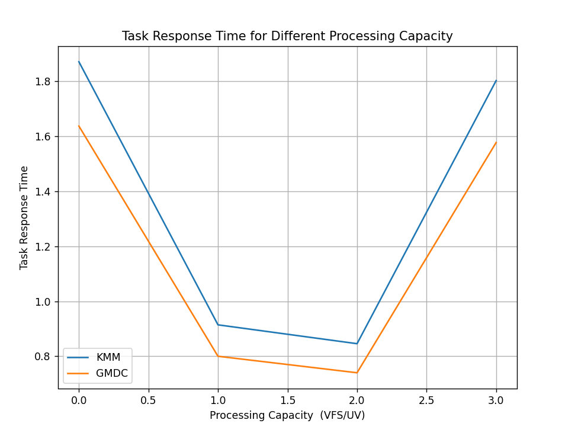
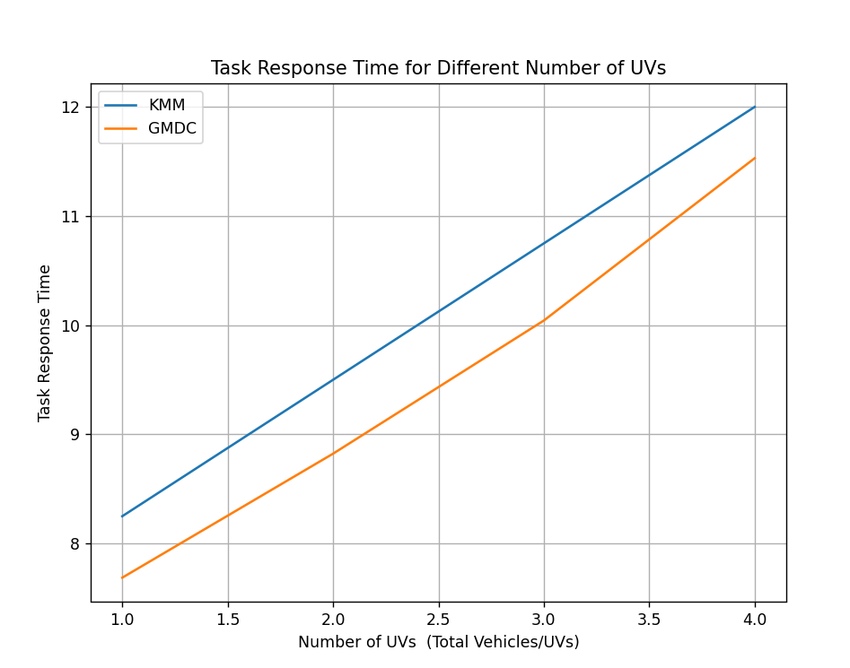

# Vehicular Mobility Model (VMM)

## To execute 
Install the dependecies

`pip install simpy`
`pip install matplotlib `

Then RUN the simulate.py
`python3 simulate.py`

it will generate the data in the form of json files

`RSU.json`
`vfs.json`
`user_vehicle.json`
`distances_rsu.json`
`distances_vfs.json`
`vehicles.json`

## Formulas Used
**Channel Loss Calculation:** These formulas compute the loss experienced by the transmitted signal over the communication channel. They take into account parameters like distance, path loss exponent, and suitable path loss coefficient for different locations (VFS or RSU).
**Transmission Rate Calculation:** These formulas determine the transmission rate achievable over the communication channel for both uplink and downlink transmissions. They consider parameters like transmission power, channel loss, and noise power, as well as the available bandwidth.
**Response Time Calculation:** This formula calculates the total response time, which includes both the computation delay and the time taken for data transmission over the channel.
**Transmission Power (P):** This constant represents the transmission power used in thecommunication system.
**Noise Power (N0) Conversion:** This formula converts the noise power from dBm to Watts for use in subsequent calculations.
**Bandwidth (B):** These constants define the bandwidth available for communication, both for uplink and downlink transmissions.
**Euclidean Distance Calculation:** This formula computes the Euclidean distance between two points in the Cartesian coordinate system. It's used to calculate the distance between vehicle nodes and VFSs or RSUs

## Algorithms used

### GMDC Algorithm:
The GMDC algorithm utilizes a greedy matching approach to assign tasks to available VFSs or RSUs. Below is the detailed outline of the algorithm:
1. Initialization:
  a. Initialize the algorithm parameters such as communication range (r), transmission power (P), noise power (N0), available bandwidth (B), and path loss exponent range.
2. Data Preparation:
  a. Load vehicle data, VFS data, RSU data, and pre-calculated distances between vehicles and VFS/RSUs.
3. Task Assignment:
  a. For each vehicle, determine potential matches with nearby VFSs and RSUs based on their respective communication ranges.
  b. Calculate the delay time for each potential match considering communication channel characteristics.
4. Greedy Matching:
  a. Apply a greedy matching strategy to minimize the total response time by selecting the best match for each vehicle.
5. Result Visualization:
  a. Visualize the assignment results and total response time for further analysis.

### **KMM Algorithm:**
The KMM algorithm, also known as the Kuhn-Munkres or Hungarian algorithm, is a more sophisticated approach for task assignment optimization. Here's how it works:
1. Initialization:
  a. Similar to GMDC, initialize algorithm parameters and load necessary data.
2. Match Determination:
  a. For each vehicle, compute the delay time for potential matches with VFSs and RSUs, considering communication channel characteristics.
3. Optimization:
  a. Utilize the Kuhn-Munkres algorithm to find the optimal assignment that minimizes the total response time across all vehicles.
4. Result Analysis:
  a. Analyze the assignment results and total response time to evaluate the effectiveness of the algorithm

plot_1

plot_2

